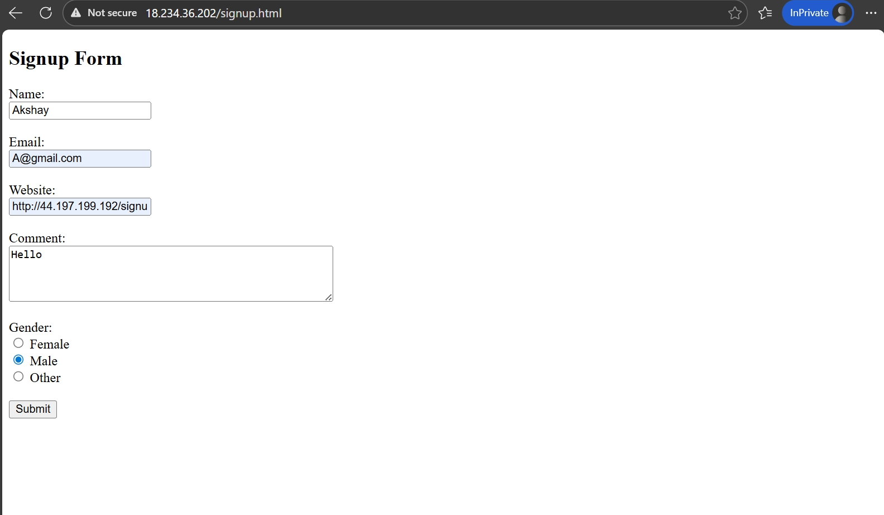
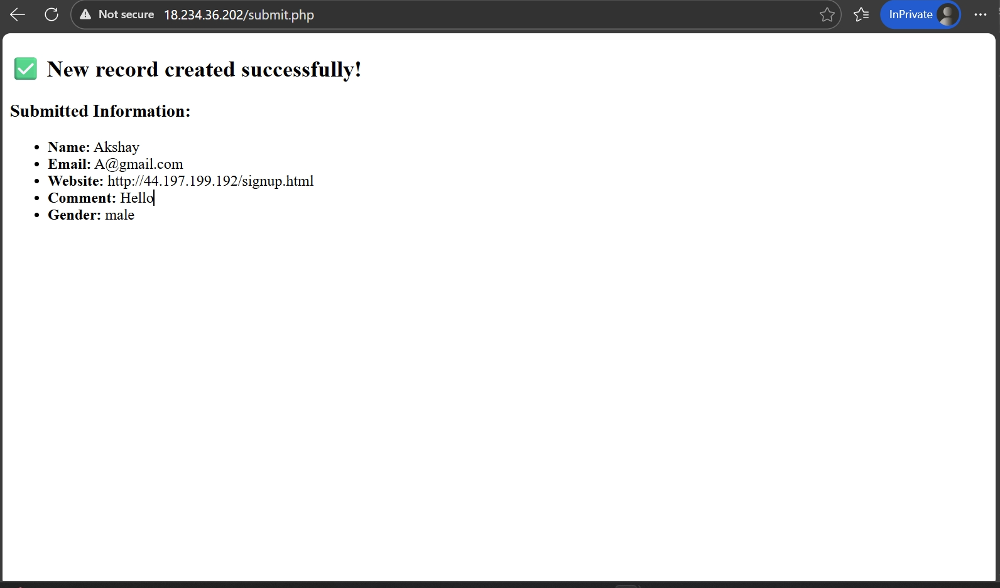

# Registration Form Deployment
## Introduction

Cloud computing enables on-demand access to computing resources over the internet. Amazon Web Services (AWS) is one of the most widely used cloud platforms. In this project, a simple user registration system is deployed on AWS using EC2, HTML, PHP, Nginx, and MySQL.
## Architecture of Registration Form Deployment :

## Project Objective:
This project focuses on deploying a Registration Form web application on AWS. It helps beginners understand cloud hosting, EC2 instance setup, and web server configuration. By completing this project, users learn how to make a static web app publicly accessible while following basic security practices.

## Technologies Used.
AWS EC2 – Amazon Web Service

Linux OS – Server operating system

Nginx – Web server

HTML – Frontend design

PHP – Backend processing ( (with PHP-FPM))

MySQL (MariaDB) – Database 
## Project Implementation Details:
### 1. Launch AWS EC2 Instance
* Create an EC2 instance form the AWS Management Console.
* Chose Amzone Linux as AMI
* Configure Security gropus to allow:
  HTTP (Port 80)
  HTTPS (Port 443)
  SSH (Port 22)

  

#### 2. Launch EC2 Instance 
    * Create an EC2 instance using Amazon Linux or Ubuntu

    * Instance Type : t3.micro(Free Tier)
    * Create or select a Key Pair
    * Configure Security Group

#### 3. Connect to EC2 Instance :

  *  ssh -i key.pem ec2-user@< Public-IP >

#### 4. Update Server Packages :
  * Update the system to install latest packages.

  * sudo yum update -y 

#### 5.Install Requirement Softwares :
  * sudo yum install nginx mariadb105-server php-fpm -y
  * sudo systemctl start nginx mariadb-server php-fpm
  * sudo systemctl enable nginx mariadb-server php-fpm

#### * PHP and HTML have been used in this project.
  * Cd /usr/share/nginx/html/index.html
  * sudo vim signup.html
  * sudo vim submit.php
  
#### 6: Create Database & Table

   * A database is a structured place to store data (tables, rows, columns).
    The SQL command CREATE DATABASE is used to create a new database in a Database Management System (DBMS) such as MySQL, PostgreSQL, SQL Server, or Oracle.

    * mysql -u root -p

    * alter user root@localhost identified by 'root';

    * create Database FCT;

    * use FCT;

    * create table student(id int primary key  
      auto_increment , name varchar(15), email varchar(50),   website varchar(300), comment varchar(300), gender varchar(15), unique(email));

 
   

### 7.Restart all the services :
    * sudo systemctl restart nginx
    * sudo systemctl restart mariadb
    * sudo systemctl restart php-fpm

### 8. Deployment Registration Form Complete :

#### * Output:

 

#### IP - https://18.234.36.202/submit.php

 

### 9.Verify Data in Database
* Check MySQL table to confirm data is stored.

 

### Conclusion:
* This project deploys a Registration Form web application on AWS using an EC2 instance with Nginx, HTML, PHP, and MySQL. It demonstrates basic cloud deployment, server configuration, and database integration. The project provides hands-on experience with real-world AWS web hosting and security basics.

  
  

 

 
